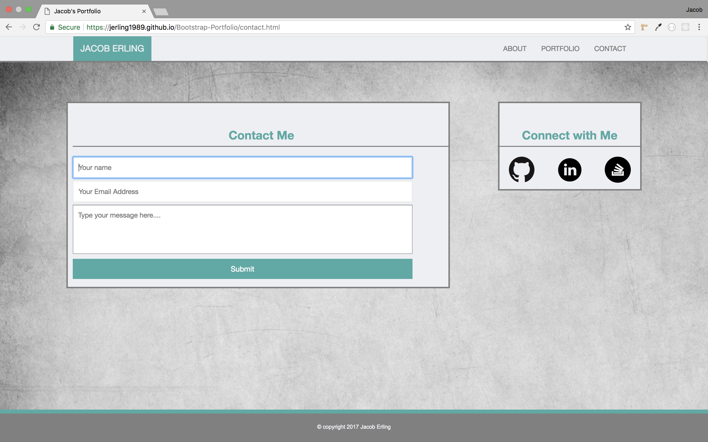

# Bootstrap-Portfolio
Here is another Portfolio Site made with HTML and CSS. This website is much different than the others because it makes use of the Bootstrap CSS Library. This was a great entry-level exercise to get used to using Bootstrap. Right away I fell in love with the responsive grid layout, how simple it is to make a site mobile responsive, and all of the documentation on the Bootstrap website.

---

- The first page the user will land on is the home or "about" page. It has a picture of me along with a description of who I am. It also has links to my GitHub, LinkedIn, and Stack Overflow accounts, as does every other page on this website.

- The next page is a mock portfolio section of the site. I added some movie posters from the UK because I liked the aesthetic of the horizontal landscape orientation on the page, as opposed to the vertical portrait orientation of US movie posters.

- Finally we have the Conact page that has a rudimentary (and non-functioning) contact form.

